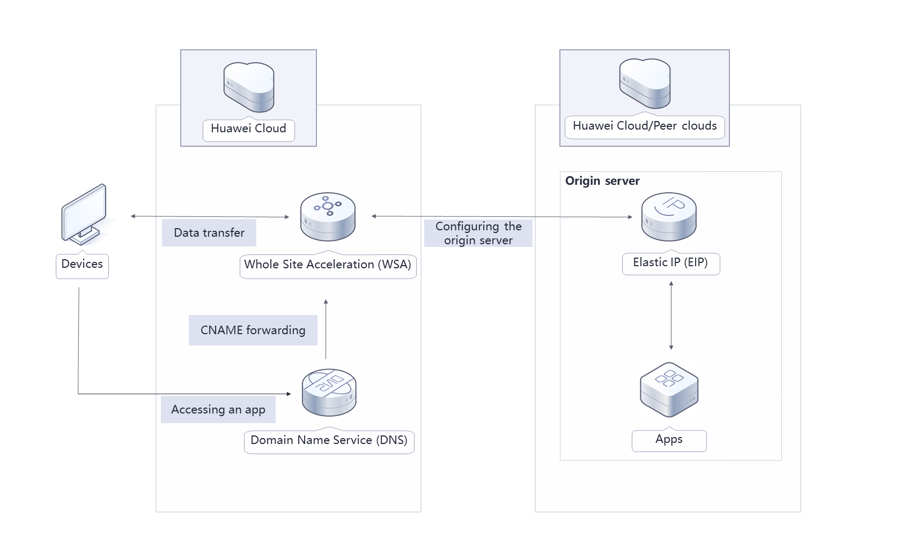

[TOC]

**Solution Overview**
===============
This solution uses the Whole Site Acceleration (WSA) to pull content from the origin server through the possible fastest route, so dynamic pages can load faster. This solution is a good option for websites that have both dynamic and static content and that need to handle a large number of ASP, JSP, or PHP requests.

**Solution Architecture**
---------------


**Architecture Description**
---------------
To use this solution, you need to:

- Add a WSA domain name and set your application server as the origin server.
- Configure a CNAME record for the domain name for the local DNS server to redirect requests to CDN.
**File Structure**
---------------

``` lua
huaweicloud-solution-global-data-transfer-acceleration
├── global-data-transfer-acceleration.tf.json -- Resource orchestration template
```

Refer to the [deployment guide](https://support.huaweicloud.com/intl/en-us/gdta-ctf/gdta_01.html) for more information.
